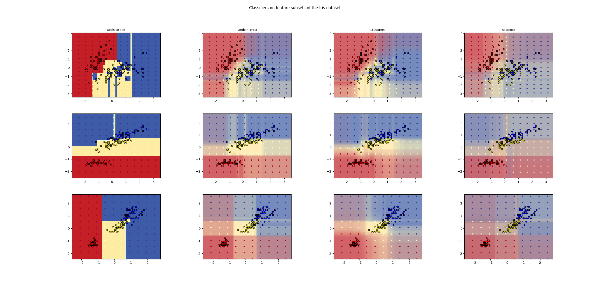

# Plot the decision surfaces of ensembles of trees on the IRIS dataset
- Reference:
    - https://scikit-learn.org/stable/auto_examples/ensemble/plot_forest_iris.html
## Description:

- This plot compares the decision surfaces learned by:
    - A decision tree classifier (first column)
    - By a random forest classifier (second column)
    - Extra-trees classifier (thrid column)
    - AdaBoost Classifier (fourth column)
- In the first row
    - the classifiers are built using the sepal width and the sepal length features only,
- On the second row 
    - Using the petal length and sepal length only
- On the first row
    - Using the petal width and the petal length only

- In descending order of Quality, when trained (outside of this example) on all 4 features
using 30 estimators and scored using 10 fold cross validation we see:
    - `ExtraTreesClassifer() # 0.95 score`
    - `RandomForestClassifier() # 0.94 score`
    - `AdaBoost(DecisionTree(max_depth=3)) # 0.94 score`
    - `DecisionTree(max_depth=None) # 0.94 score`
- Increasing `max_depth` for AdaBoost lowers the standard deviation of the scores (but the
average score does not improve).

- See the console's output for further details about each model
- In this example you might try to:
    1. Vary the `max_depth` for the `DecisionTreeClassifier` and `AdaBoostClassifer`, perhaps
    try `max_depth=3` for the `DecisionTreeClassifier` or `max_depth=None` for `AdaBoostClassifer`
    2. Vary `n_estimators`
    
- It is worth noting that `RandomForests` and `ExtraTrees` can be fitted in parallel on many cores
as each tree is built independently of the others.
- AdaBoost's samples are built sequentially and so do not use multiple cores.

